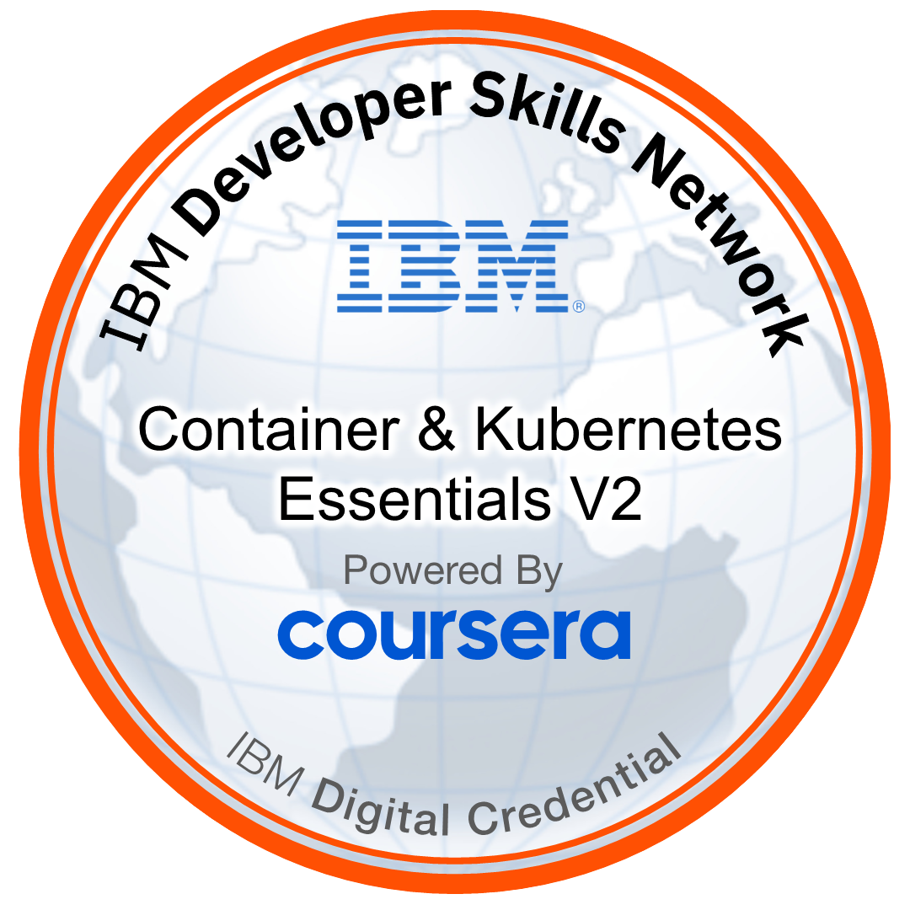

<!--   my-icons -->
<!--

    
    
    
    
     
    
    
 
    -->

<!--   my-header-img -->

<!--   my-ticker -->    

<!--   GitHub stats graph -->
<!-- ### 📈 GitHub Activity Graph:
 -->

## Tecnologias que eu uso

 
  
  
  
  
  
  
   
  
  
  
  
  
  
  
  
  
  
  

## Badges

## Outras comunidades que eu participo

| .                                                                                                                                       | .                                                                                                                         |
|-----------------------------------------------------------------------------------------------------------------------------------------|---------------------------------------------------------------------------------------------------------------------------|
|  |  |

<!--</img>-->

<!--   grid-snake -->

